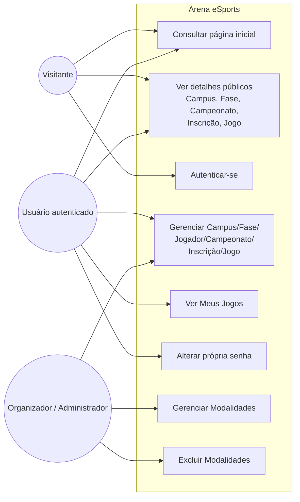
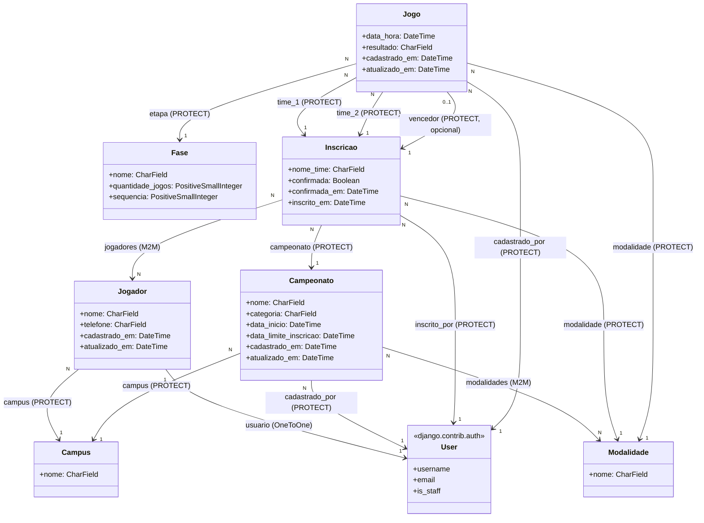
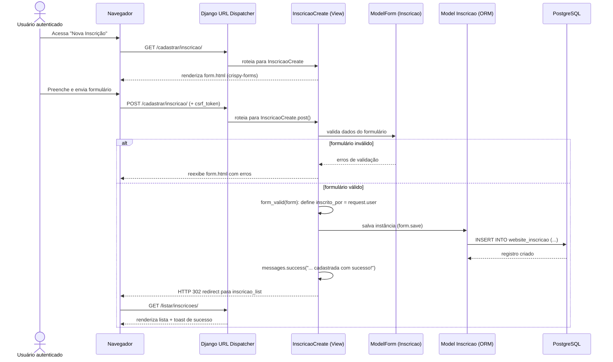
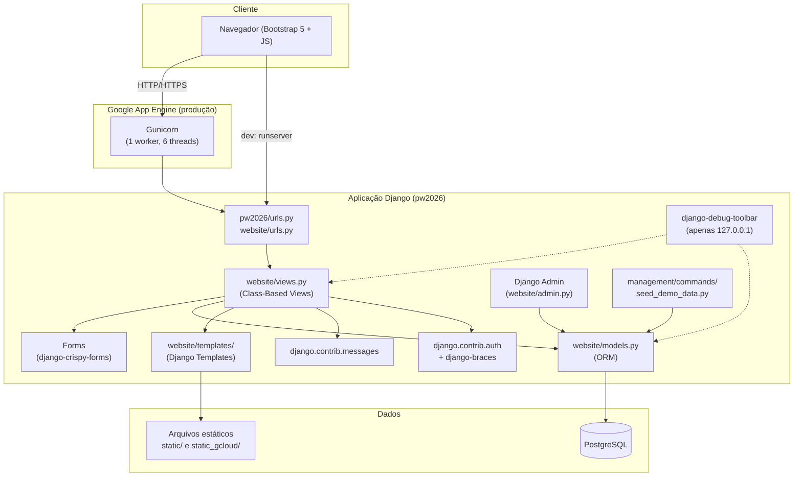
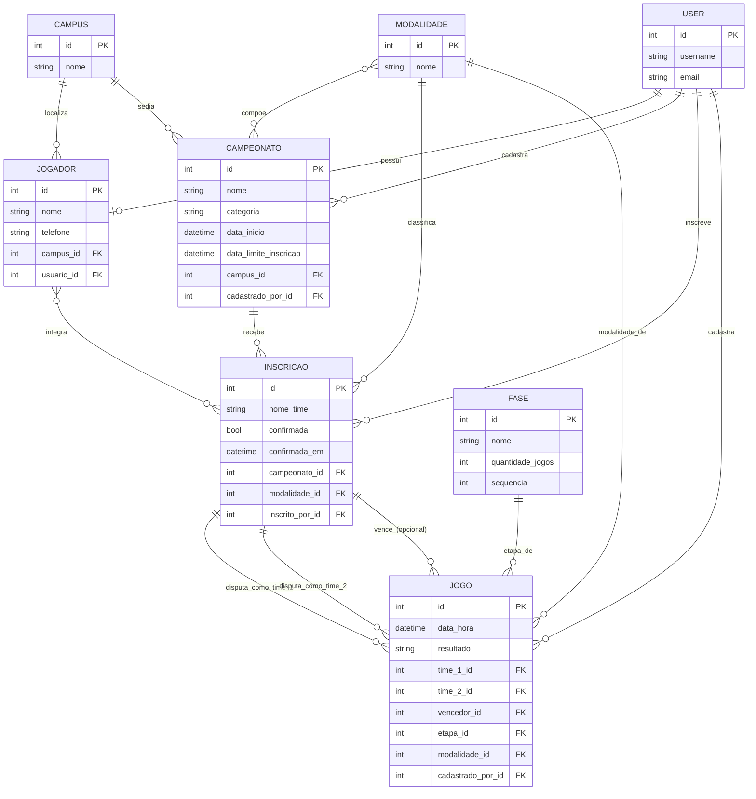

# 3. UML e Arquitetura

Todos os diagramas abaixo foram reconstruídos a partir do código-fonte (`website/models.py`, `website/views.py`, `website/urls.py`, `pw2026/settings.py`). Foram simplificados para priorizar legibilidade.

## 3.1 Diagrama de Casos de Uso

Baseado nas classes de view em [website/views.py](../website/views.py) e nas restrições de acesso (`LoginRequiredMixin`, `GroupRequiredMixin`).

Observação: `UC4` agrega os CRUDs de Campus, Fase, Jogador, Campeonato, Inscrição e Jogo porque compartilham o mesmo padrão de acesso (`LoginRequiredMixin`, com filtro adicional por "dono" do registro em Jogador/Campeonato/Inscrição/Jogo — ver seção de Regras de Negócio).

## 3.2 Diagrama de Classes (modelo de domínio simplificado)

Baseado em [website/models.py](../website/models.py) e nas migrações [0001_initial.py](../website/migrations/0001_initial.py) e [0002_...py](../website/migrations/0002_campus_campeonato_campus_alter_jogador_campus_and_more.py).

## 3.3 Diagrama de Sequência — Cadastro de Inscrição

Fluxo reconstruído a partir de `InscricaoCreate` em [website/views.py](../website/views.py), do template [form.html](../website/templates/website/form.html) e das URLs em [website/urls.py](../website/urls.py).

## 3.4 Diagrama de Arquitetura / Componentes

Baseado em [pw2026/settings.py](../pw2026/settings.py), [app.yaml](../app.yaml) e na estrutura de pastas do repositório.

## 3.5 Diagrama Entidade-Relacionamento (simplificado)

Baseado nas migrações do app `website` e nos campos de `website/models.py`.

